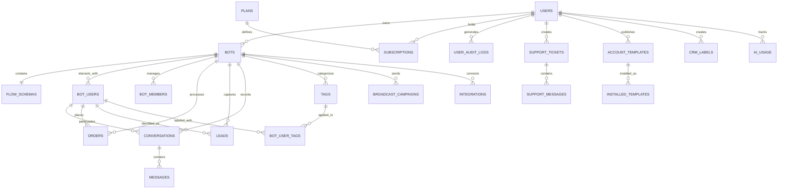

# Launchly — Data Model & Schema Specification

Launchly uses **PostgreSQL** as its primary database, combined with native `JSONB` column types for dynamic flow graph structures and flexible user metadata. Database migrations are strictly managed using **Liquibase** across 54 changelogs.

---

## Entity Relationship Diagram

---

## Core Schema Details

### 1. `users`
Represents platform account holders, administrators, and team members.
- `id` (BIGSERIAL, PK)
- `email` (VARCHAR, UNIQUE, NOT NULL)
- `password` (VARCHAR, hashed with BCrypt)
- `name` (VARCHAR, NOT NULL)
- `avatar` (VARCHAR)
- `role` (VARCHAR, `ROLE_SUPER_ADMIN`, `ROLE_OWNER`, `ROLE_ADMIN`, `ROLE_MANAGER`)
- `provider` (VARCHAR, `LOCAL`, `GOOGLE`)
- `is_active` (BOOLEAN, DEFAULT true)
- `is_email_verified` (BOOLEAN, DEFAULT false)
- `telegram_user_id` (BIGINT, UNIQUE)
- `timezone` (VARCHAR, DEFAULT 'Europe/Kyiv')
- `automation_folders` (JSONB)

### 2. `bots`
Core automation bot entity bound to a Telegram token.
- `id` (BIGSERIAL, PK)
- `name` (VARCHAR(500), NOT NULL)
- `username` (VARCHAR(255))
- `description` (TEXT)
- `avatar` (TEXT)
- `avatar_public_id` (VARCHAR(255))
- `telegram_token` (VARCHAR, NOT NULL, AES-256 encrypted)
- `is_active` (BOOLEAN, DEFAULT false)
- `order_sequence` (BIGINT, DEFAULT 1000)
- `is_blocked` (BOOLEAN, DEFAULT false)
- `block_reason` (VARCHAR(1000))
- `custom_fields_data` (JSONB)
- `runs_count` (INTEGER, DEFAULT 1)
- `user_id` (BIGINT, FK -> `users.id` ON DELETE CASCADE)

### 3. `flow_schemas`
React Flow visual constructor canvas definition.
- `id` (BIGSERIAL, PK)
- `version` (INTEGER, DEFAULT 1)
- `nodes` (JSONB, NOT NULL, Array of React Flow node objects)
- `edges` (JSONB, NOT NULL, Array of connection lines)
- `bot_id` (BIGINT, UNIQUE, FK -> `bots.id` ON DELETE CASCADE)

### 4. `bot_users`
Subscribers / end-users interacting with a bot on Telegram.
- `id` (BIGSERIAL, PK)
- `telegram_id` (BIGINT, NOT NULL)
- `username` (VARCHAR(255))
- `first_name` (VARCHAR(255))
- `last_name` (VARCHAR(255))
- `current_node_id` (VARCHAR(255))
- `photo_url` (VARCHAR(512))
- `metadata` (JSONB, DEFAULT '{}')
- `bot_id` (BIGINT, FK -> `bots.id` ON DELETE CASCADE)

### 5. `conversations` & `messages`
Real-time live chat conversations between customer and agent/bot.
- **`conversations`**:
  - `id` (BIGSERIAL, PK)
  - `status` (VARCHAR, `OPEN`, `PENDING`, `CLOSED`)
  - `unread` (BOOLEAN, DEFAULT false)
  - `is_favorite` (BOOLEAN, DEFAULT false)
  - `tags` (JSONB, DEFAULT '[]')
  - `notes` (TEXT)
  - `bot_id` (BIGINT, FK -> `bots.id`)
  - `bot_user_id` (BIGINT, FK -> `bot_users.id`)
- **`messages`**:
  - `id` (BIGSERIAL, PK)
  - `content` (TEXT, NOT NULL)
  - `sender_type` (VARCHAR, `BOT`, `USER`, `AGENT`)
  - `media_url` (TEXT)
  - `media_type` (VARCHAR(20))
  - `scheduled_at` (TIMESTAMP)
  - `sent` (BOOLEAN, DEFAULT true)
  - `conversation_id` (BIGINT, FK -> `conversations.id` ON DELETE CASCADE)

### 6. `leads` & `orders`
CRM e-commerce and contact capture pipelines.
- **`leads`**: `id`, `name`, `email`, `phone`, `source`, `status` (`NEW`, `CONTACTED`, `QUALIFIED`, `CONVERTED`, `LOST`), `notes`, `data` (JSONB), `bot_id`, `bot_user_id`.
- **`orders`**: `id`, `order_number`, `status` (`NEW`, `PROCESSING`, `PAID`, `SHIPPED`, `CANCELLED`), `total_amount`, `currency`, `items` (JSONB), `bot_id`, `bot_user_id`.

### 7. `broadcast_campaigns`
Mass messaging engine for subscriber cohorts.
- `id` (BIGSERIAL, PK)
- `name` (VARCHAR, NOT NULL)
- `message` (TEXT, NOT NULL)
- `status` (VARCHAR, `DRAFT`, `SCHEDULED`, `SENDING`, `COMPLETED`, `CANCELLED`)
- `filter_type` (VARCHAR, `ALL`, `TAG`, `DATE`)
- `sent_count`, `failed_count`, `total_count` (INTEGER)
- `nodes`, `edges` (JSONB)
- `scheduled_at` (TIMESTAMP)
- `bot_id` (BIGINT, FK -> `bots.id`)

### 8. `plans` & `subscriptions`
Billing tiers and customer payment records.
- **`plans`**: `id`, `name` (`FREE`, `STARTER`, `PRO`, `UNLIMITED`), `price`, `max_bots`, `max_bot_users`, `max_broadcasts_per_month`, `can_use_ai_agent`, `can_use_integrations`, `stripe_price_id`.
- **`subscriptions`**: `id`, `status` (`ACTIVE`, `PAST_DUE`, `CANCELLED`), `stripe_subscription_id`, `stripe_customer_id`, `current_period_start`, `current_period_end`, `user_id`, `plan_id`.

### 9. `account_templates` & `installed_templates`
Community templates and bot cloning system.
- `share_code`, `name`, `description`, `schema_json`, `views_count`, `installs_count`, `creator_id`, `source_bot_id`.

### 10. `ai_usage`
Daily token budget and usage metering per user.
- `user_id`, `usage_date`, `request_count`, `tokens_used` (BIGINT).
