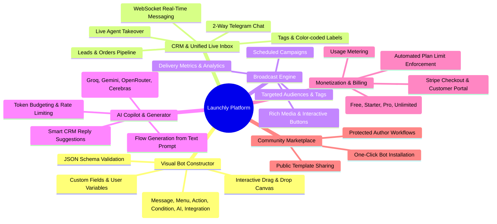

# Launchly — Platform Features Specification

Launchly is an enterprise-ready, all-in-one automation platform for Telegram bots, customer relations management, AI workflow generation, and subscription monetization.

---

## Feature Matrix Overview

---

## 1. Visual Bot Constructor & Flow Engine

- **Drag-and-Drop Canvas**: Built on `@xyflow/react`, enabling visual assembly of complex conversational graphs.
- **Rich Node Library**:
  - `Message Node`: Plain text, markdown formatting, photo/video/audio attachments.
  - `Menu / Button Node`: Inline keyboards, URL links, flow branch navigation.
  - `Action Node`: Variable assignment, tag application, external Webhook calls, Google Sheets export.
  - `Condition Node`: Branching logic based on user answers, subscription status, or custom metadata.
  - `AI Node`: Dynamic prompt execution and automated chatbot replies.
- **Robust Execution Engine**:
  - Stateless execution with session state stored in PostgreSQL JSONB.
  - Sub-millisecond step routing and safe fallback handlers.
  - Automatic circular loop detection and schema integrity validation.

---

## 2. Omnichannel CRM & Live Inbox

- **Real-Time Live Chat**: Two-way customer communication powered by Spring WebSockets (STOMP protocol) and SockJS.
- **Agent Takeover**: Seamlessly pause bot automated flows to allow human customer support agents to intervene.
- **Leads & Deals Pipeline**:
  - Automatic lead extraction from bot interactions (names, phone numbers, emails, order details).
  - Status pipeline: `NEW` -> `CONTACTED` -> `QUALIFIED` -> `CONVERTED` -> `LOST`.
- **Order Management**:
  - E-commerce cart tracking, item quantities, total calculation in local currency (UAH/USD/EUR).
  - Order status tracking: `NEW` -> `PROCESSING` -> `PAID` -> `SHIPPED` -> `CANCELLED`.
- **Labels & Custom Tags**: Multi-label tagging system for customer segmentation and fast filtering.

---

## 3. Scheduled Broadcasts & Campaign Engine

- **Flexible Targeting**:
  - Broadcast to all bot subscribers or segment by tags, activity date, or custom attributes.
- **Rich Media & Interactive Buttons**: Attach images, video clips, and customized call-to-action buttons.
- **Scheduling**: Immediate dispatch or background scheduling via cron-based campaign worker.
- **Analytics & Delivery Metrics**: Real-time counters for `sentCount`, `failedCount`, and `totalCount`.

---

## 4. Multi-Provider AI Assistant & Bot Generator

- **Natural Language Bot Generation**: Describe a bot in plain English or Ukrainian (e.g., *"Create a coffee shop bot with 3 drink categories, cart, and delivery address"*), and Launchly generates a fully connected React Flow schema.
- **Multi-Model Provider Router**:
  - Dynamic fallback between Groq, Google Gemini 2.5, OpenRouter, and Cerebras.
  - Latency and rate limit budgeting per plan tier.
  - Automatic JSON schema repair and validation.

---

## 5. Team Management & Granular RBAC

- **Role Hierarchy**:
  - `ROLE_SUPER_ADMIN`: Global platform oversight, audit logs, system broadcasts, user moderation.
  - `ROLE_OWNER`: Full control over account bots, billing, team invitations, and integrations.
  - `ROLE_ADMIN`: Bot configuration, broadcast execution, template creation.
  - `ROLE_MANAGER`: CRM inbox response, lead updates, order fulfillment.
- **Team Invitations**: Secure email-based token invites with custom permission flags (e.g., `inbox_seat`, `billing_permission`).

---

## 6. Stripe Subscriptions & Usage Limits

- **Plan Tiers**:
  - **Free**: 1 bot, up to 100 subscribers, core builder.
  - **Starter**: 3 bots, 1,000 subscribers, 5 broadcasts/month, webhooks.
  - **Pro**: 10 bots, 10,000 subscribers, unlimited broadcasts, full AI agent, integrations.
  - **Unlimited**: 100 bots, 100,000 subscribers, priority routing.
- **Enforcement**: Automatic validation in `PlanLimitService` protecting against quota overages.

---

## 7. Account Templates Marketplace

- **Shareable Codes**: Generate unique public or protected share codes for any configured bot flow.
- **One-Click Clone**: Instantly clone templates into a new bot instance including nodes, edges, tags, and broadcast templates.
- **Analytics**: Track template views and install counts.

---

## 8. Transactional Outbox & Webhook Ingress Engine

- **Guaranteed Delivery (At-Least-Once)**: Atomically stores integration events (Hotmart purchases, refunds, lead synchronizations) in PostgreSQL outbox table alongside domain mutations.
- **Asynchronous Dispatcher**: Background worker dispatches outbox events with exponential backoff and jitter.
- **Dead Letter Queue (DLQ)**: Automatically isolates unprocessable events after 5 failed retry attempts.
- **Admin Outbox Inspector**: Real-time REST endpoints (`/api/v1/admin/outbox`) for searching, filtering, and manually retrying failed/dead-letter events.

---

## 9. Distributed Idempotency & Concurrency Protection

- **Replay Prevention**: `@Idempotent` annotation and filter backed by Redis distributed locks (`idempotency:lock:`) and cached response storage (`idempotency:response:`).
- **Protected Mutations**: AI bot generation, broadcast dispatches, team invitations, support appeals, and external webhook deliveries.
- **Graceful Conflict Handling**: Returns HTTP 409 on active concurrent requests and transparently returns cached successful responses on retried client submissions.

---

## 10. Multi-Tenant Tier-Based Rate Limiting & Enterprise Security

- **Token-Bucket Rate Limiter**: Per-user and per-IP dynamic request throttling powered by Bucket4j and Redis.
- **Tier Capacities**: Dynamically scales request capacities according to subscription tier (`FREE`: 12,000 req/min, `PRO`: 30,000 req/min, `ENTERPRISE`: 60,000 req/min, `ADMIN`: 120,000 req/min).
- **Standardized RFC Headers**: Emits `X-RateLimit-Limit`, `X-RateLimit-Remaining`, `X-RateLimit-Reset`, and `Retry-After`.
- **Enterprise Security Headers**: Strict HSTS (`max-age=31536000; includeSubDomains; preload`), `X-Content-Type-Options: nosniff`, `X-Frame-Options: SAMEORIGIN`, `Referrer-Policy: strict-origin-when-cross-origin`, and `Permissions-Policy`.
- **Zero-Leakage PII Masking**: Real-time redaction of sensitive credentials, payment details, phone numbers, and email identifiers across all application log appenders for GDPR and SOC2 compliance.

---

## 11. High-Concurrency Performance & Stress Testing

- **Deep Entity Graphs**: JPA `@EntityGraph` and `JOIN FETCH` queries eliminating N+1 SELECT latency under 200+ RPS read traffic.
- **Automatic JDBC Batching**: Configured Hibernate statement batching (batch size = 50) and insert/update ordering for high-volume database writes.
- **Automated k6 Test Suite**: 17 specialized TypeScript load and stress scenarios covering authentication bursts, Telegram webhook surges, CRM lead pipelines, AI generation, and entity graph traversal.
