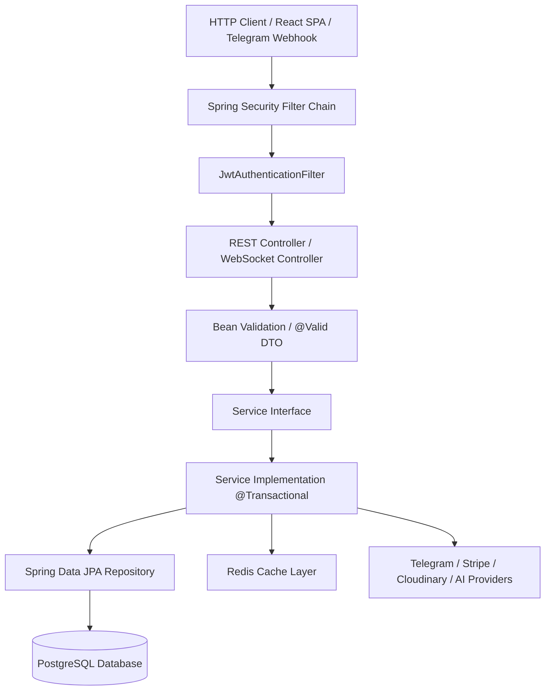

# Launchly — Backend Architecture Specification

This document details the architectural principles, design patterns, and request execution lifecycles of the Launchly Backend platform.

For the complete list of REST endpoints and WebSocket channels, see [docs/backend/API_SURFACE.md](API_SURFACE.md).

---

## Architectural Paradigm

Launchly Backend is built as a **Modular Monolith** organized by domain features (**Package-by-Feature**), adhering to **Clean Architecture** principles:

```
backend/src/main/java/com/launchly/
├── admin/          # Platform administration, moderation, audit logging, support tickets
├── ai/             # Multi-provider AI router, prompt loading, token usage & budgeting
├── analytics/      # Metric aggregations, event ingestion, telemetry
├── auth/           # JWT token generation, refresh rotation, OAuth2 SSO, Telegram login
├── billing/        # Stripe integration, subscription lifecycles, webhook fulfillment
├── blog/           # Knowledge base and public blog content management
├── bot/            # Bot lifecycle, Telegram engine, node execution, flow schemas, templates
├── broadcast/      # Mass messaging campaigns, scheduling, recipient filtering
├── common/         # Cross-cutting concerns: Security, Config, Exception handling, Caching, Utils
├── crm/            # Live chat inbox, WebSocket STOMP messaging, Leads & Orders pipeline, Labels
├── integration/    # External connectors (Google Sheets, Webhooks, custom APIs)
└── media/          # Cloudinary uploads, MIME type validation, asset transformations
```

---

## Layer Responsibilities



### 1. Controllers & Security Layer (`controller/`)
- HTTP request mapping, parameter validation (`@Valid`), OpenAPI documentation annotations.
- Decoupled from data persistence; returns strictly typed DTO responses (`ResponseEntity<T>`).
- Access control enforced via `@PreAuthorize` and `CustomUserDetails`.

### 2. Service Layer (`service/` & `service/impl/`)
- Encapsulates all domain logic, transaction boundaries (`@Transactional`), and business invariants.
- Coordinates between persistence repositories, cache eviction, and third-party integrations.

### 3. Data Access Layer (`repository/` & `entity/`)
- Spring Data JPA repositories with query derivation and custom JPQL/Native queries for performance.
- Entities inherit common audit fields (`created_at`, `updated_at`, `id`) from `BaseEntity`.
- Complex nested graphs (nodes, edges, custom fields) persist as native PostgreSQL `JSONB`.

---

## Key Backend Architectural Patterns

### 1. Multi-Provider AI Routing & Fallback
The AI module routes requests dynamically across four inference providers (**Groq**, **Gemini**, **OpenRouter**, **Cerebras**) using a priority strategy with timeout budgets and automatic failover. Responses are verified through `AiSchemaUtils` to guarantee valid JSON graph syntax before returning to the caller.

### 2. Real-Time CRM & Live Agent Takeover
The CRM module combines HTTP REST APIs for query operations and **Spring WebSocket / STOMP** for sub-second bidirectional messaging.
- When an end-user sends a message on Telegram, the `TelegramEngine` updates the `Conversation` and broadcasts a STOMP event to `/topic/conversations/{botId}`.
- When a human agent types a response in the CRM web UI, the backend sends the message to the Telegram API and pushes a delivery confirmation to the browser.

### 3. Plan Limit Enforcement (`PlanLimitService`)
Every critical creation endpoint (e.g., creating a bot, sending a broadcast campaign, initiating an AI generation) passes through `PlanLimitService`. Quotas are verified against active Stripe subscription limits (`Plan.maxBots`, `Plan.maxBroadcastsPerMonth`, token counters in `ai_usage`).

### 4. Zero-Downtime Schema Migrations (Liquibase)
Database alterations are strictly managed via YAML/SQL Liquibase changelogs (`db-changelog-master.yaml`). All DDL modifications use non-blocking statements (`IF NOT EXISTS`, safe column defaults) to enable continuous integration and blue-green deployments.

---

## Concurrency & Virtual Threads

Launchly enables **Java 21 Virtual Threads** (`spring.threads.virtual.enabled=true`) alongside **Tomcat Connection Pooling** (`max-connections=10000`, `accept-count=1000`). This ensures lightweight, thread-per-request concurrency for blocking operations like HTTP calls to Telegram, Stripe, and AI inference APIs without exhausting OS thread pools.
