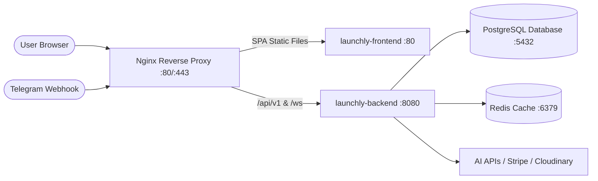

# Launchly — Production Deployment & DevOps Guide

This guide details how Launchly is built, packaged into production Docker containers, and deployed using GitHub Actions and Docker Compose.

---

## Architecture Overview



---

## 1. Multi-Stage Container Builds

Both backend and frontend leverage optimized multi-stage Docker builds to produce lightweight, secure production images.

### Backend (`backend/Dockerfile`)
- **Stage 1 (Builder)**: `maven:3.9.9-eclipse-temurin-21-alpine` runs `mvn package -DskipTests` to compile executable JAR with cached dependencies.
- **Stage 2 (Runtime)**: `eclipse-temurin:21-jre-alpine` runs the optimized fat JAR under a non-root system user. Includes custom healthcheck at `/actuator/health`.

### Frontend (`frontend/Dockerfile`)
- **Stage 1 (Builder)**: `node:22-alpine` runs `npm ci --legacy-peer-deps` and `npm run build`.
- **Stage 2 (Runtime)**: `nginx:alpine` serves static assets via high-performance `nginx.conf` with Gzip compression, SPA fallback routing (`try_files $uri /index.html`), and caching headers.

---

## 2. Docker Compose Production Setup (`docker-compose.prod.yml`)

To run the full production stack on a VPS / dedicated server:

```bash
# 1. Clone repository on production server
git clone https://github.com/polchduikt/launchly.git /opt/launchly
cd /opt/launchly

# 2. Configure environment variables in .env
cp .env.example .env

# 3. Pull and launch all containers
docker compose -f docker-compose.prod.yml up -d --remove-orphans
```

---

## 3. GitHub Actions CI/CD Pipeline

The project includes automated pipelines:

1. **`checks.yml` (Pull Requests & Pushes to `main`/`dev`)**:
   - **Backend**: Compiles Java 21 code, executes 389+ Spring Boot & PostgreSQL Testcontainers tests, generates JaCoCo coverage, and runs SonarCloud analysis.
   - **Frontend**: Runs ESLint, 310+ Vitest tests with coverage, TypeScript compiler, and Vite production build.
   - **Docker Validation**: Concurrently tests Docker container builds for both backend and frontend.

2. **`deploy.yml` (Push to `main` or Manual Workflow Dispatch)**:
   - Authenticates with GitHub Container Registry (**GHCR**).
   - Builds multi-platform Docker images and tags them with commit SHA and `latest`.
   - Optionally deploys to a remote server over SSH via `appleboy/ssh-action`.
