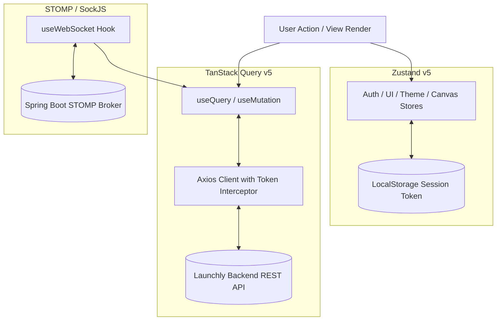

# Launchly — Frontend Architecture Specification

This document outlines the architecture, directory structure, state management paradigms, and testing strategies of the Launchly React Single Page Application (SPA).

---

## Technical Stack

- **Framework & Runtime**: React 19 + TypeScript + Vite 8
- **Styling**: Tailwind CSS v4 + Lucide Icons + React Simple Icons
- **Visual Bot Graph**: `@xyflow/react` (React Flow)
- **Server State & Caching**: `@tanstack/react-query` v5
- **Client State**: `zustand` v5
- **Form Handling & Validation**: `react-hook-form` + `zod` v4
- **Routing**: `react-router-dom` v7 (nested layouts, lazy loading, role guards)
- **Real-Time Client**: `@stomp/stompjs` + `sockjs-client`
- **Testing**: `vitest` + `@testing-library/react` + `@playwright/test`

---

## Directory Organization

```
frontend/src/
├── api/             # Axios instance, interceptors, typed REST endpoints
├── assets/          # Static logos, illustration SVGs, branding assets
├── components/      # Shared reusable design system components
│   ├── common/      # Buttons, Modals, Inputs, Dropdowns, Toast, Badges
│   ├── layout/      # Sidebar, Header, UserMenu, AuthLayout, DashboardLayout
│   └── bot-builder/ # React Flow custom nodes, side panel, toolbar, inspector
├── context/         # React contexts (Theme, WebSocket live provider)
├── hooks/           # Custom React hooks (useAuth, useDebounce, useMediaQuery)
├── pages/           # Route-level page components (Auth, Dashboard, Bots, CRM, Analytics, Billing)
├── router/          # AppRouter, protected route guards, role-based access rules
├── store/           # Zustand state slices (authStore, uiStore, canvasStore)
├── types/           # TypeScript interfaces, DTOs, and schema types
└── utils/           # Helper utilities (formatters, dates, token storage)
```

---

## State Management Architecture

Launchly strictly enforces separation between **Server State** and **Client State**:



### 1. Server State (`@tanstack/react-query`)
- All asynchronous data retrieved from the backend (bots, campaigns, CRM messages, analytics, plans) is managed via TanStack Query.
- Utilizes automatic background revalidation, query key caching, and optimistic UI mutations for instant feedback.

### 2. Client-Only State (`zustand`)
- Handles synchronous, client-specific state:
  - `useAuthStore`: Current authenticated user profile, access token memory cache, logout handler.
  - `useCanvasStore`: Active node selection, zoom level, dragging state in bot constructor.
  - `useUIStore`: Sidebar collapse, dark/light theme, active modals.

### 3. Visual Graph Architecture (`@xyflow/react`)
- Visual flow diagrams are rendered using modular React Flow nodes:
  - Custom node components (`MessageNode`, `MenuNode`, `ActionNode`, `ConditionNode`, `AiNode`).
  - Strict data validation mapping between React Flow's `{ nodes, edges }` and backend `FlowSchema` JSON format.

---

## Security & Silent Token Refresh

- Access tokens are stored in memory (`authStore`) and attached via Axios request interceptors.
- On HTTP 401 response, an Axios response interceptor intercepts the failure, invokes `/api/v1/auth/refresh-token`, updates the in-memory token, and replays any queued concurrent requests seamlessly.
- Role-based route guards (`RoleGuard.tsx`, `AuthGuard.tsx`) prevent unauthorized access to Admin and Billing routes before rendering components.
